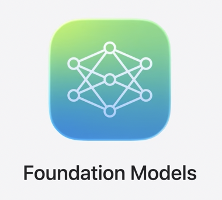
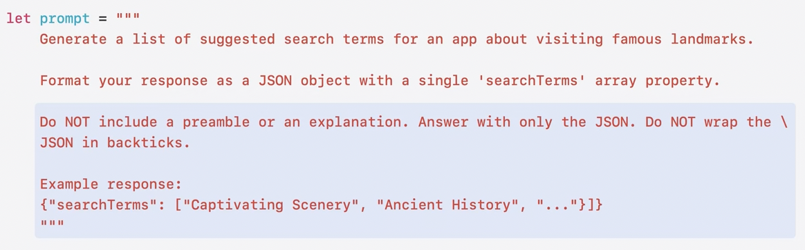
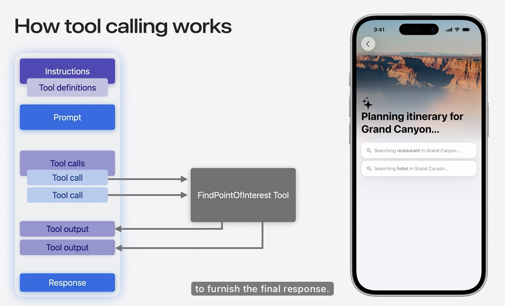

# Foundation Models 프레임워크 만나보기


## Foundation Model Framework



* Apple Intelligence 기반 온디바이스 대규모 언어 모델을 Swift API로 제어.
* iOS, macOS, iPadOS, visionOS 지원
* **On-Device** : 오프라인에서 동작 가능, 개인정보 보호
* OS 에서 동작 : 앱 크기 증가 X

## The Model

Xcode 에서 prompt 를 보내서 모델을 테스트할 수 있음

```swift
import FoundationModels
import Playgrounds

#Playground {
    let session = LanguageModelSession()
    let response = try await session.respond(to: "What's a good name for a trip to Japan? Respond only with a title")
}
```

* 기능
    * 요약
    * 추출
    * 분류
    * 태깅
    * Composition
    * 재작성

(On device 모델이기 때문에 서버에서 돌리는 고급 모델보다는 성능이 낮음을 언급)

## Guided generation

문제 : 모델은 사람은 읽기 쉽지만 view 에는 바로 적용하기 어려운 자연어를 출력함

임시방편 : JSON / CSV 같은 형태를 모델에 요청

문제 : 굉장히 구체적인 지침을 모델에 전달해야 함. 결국 별도의 데이터 추출 과정이 필요하며 모델은 확률적이기 때문에 구조적인 오류로 인한 신뢰 불가 문제



해결책 : Guided generation

```swift
@Generable
struct SearchSuggestions {
    @Guide(description: "A list of suggested search terms", .count(4))
    var searchTerms: [String]
}

// Responding with a Generable type

let prompt = """
    Generate a list of suggested search terms for an app about visiting famous landmarks.
    """

let response = try await session.respond(
    to: prompt,
    generating: SearchSuggestions.self
)

print(response.content)
```

* `@Generable`, `@Guide` 매크로로 구조화된 출력 생성
* JSON 파싱 문제 없이 안정적인 구조 반환
* Swift 로 mapping 해서 객체를 view 로 바로 받을 수 있음
* 구조적 정확성을 보장
* 간단한 프롬프트 사용 가능
* 모델의 정확도 향상, 추론 속도 높이는 최적화

## Snapshot streaming

Foundation Model Framework 는 기존의 다른 LLM 과는 달리 텍스트를 토큰이라는 짧은 문자 단위로 생성하지 않음

Delta Streaming 방식 대신에 snapshot 으로 변환

```swift
// PartiallyGenerated types

@Generable struct Itinerary {
    var name: String
    var days: [Day]
}

// Streaming partial generations

let stream = session.streamResponse(
    to: "Craft a 3-day itinerary to Mt. Fuji.",
    generating: Itinerary.self
)

for try await partial in stream {
    print(partial)
}

// SwiftUI
@State
private var itinerary: Itinerary.PartiallyGenerated?

var body: some View {
    //...
    Button("Start") {
        Task {
            do {
                let prompt = """
                    Generate a \(dayCount) itinerary \
                    to \(landmarkName).
                    """
                
                let stream = session.streamResponse(
                    to: prompt,
                    generating: Itinerary.self
                )
                
                for try await partial in stream {
                    self.itinerary = partial
                }
            } catch {
                print(error)  
            }
        }
    }
}
```

SwiftUI 등에서 자연스럽게 UI와 연동 가능

## Tool calling

모델이 앱 내 코드를 실행할 수 있게 해주는 기능. Tool protocol 사용

프로그래밍적으로 결정하기 어려운 상황에서 어떤 도구를 언제 사용할지 판단 가능 (최근 사건, 개인 데이터 등을 모델에 제공할 수 있음. e.g. 여행 앱에서 MapKit 으로 다양한 위치 정보 받아옴)



1. 세션에 도구 제공, 세션은 도구를 instruction 과 함께 모델에 제시
2. Prompt
3. Tool 을 호출하는 게 더 좋다고 판단이 될 경우 하나 이상의 Tool 호출
4. Foundation Model Framework 는 tool 을 위해 작성한 개발자의 코드를 자동으로 실행
5. Tool 의 output 과 함꼐 응답 반환

```swift
import WeatherKit
import CoreLocation
import FoundationModels

struct GetWeatherTool: Tool {
    // Tool 이름, 자연어 설명. Framework 가 이 설명으로 Tool 을 언제 호출할지 이해할 수 있음
    let name = "getWeather"
    let description = "Retrieve the latest weather information for a city"

    @Generable
    struct Arguments {
        @Guide(description: "The city to fetch the weather for")
        var city: String
    }

    func call(arguments: Arguments) async throws -> ToolOutput {
        // 원하는 내용 작성
        let places = try await CLGeocoder().geocodeAddressString(arguments.city)
        let weather = try await WeatherService.shared.weather(for: places.first!.location!)
        let temperature = weather.currentWeather.temperature.value

        // output
        let content = GeneratedContent(properties: ["temperature": temperature])
        let output = ToolOutput(content)

        // Or if your tool’s output is natural language:
        // let output = ToolOutput("\(arguments.city)'s temperature is \(temperature) degrees.")

        return output
    }
}

// 세션에서 tool 사용
let session = LanguageModelSession(
    tools: [GetWeatherTool()],
    instructions: "Help the user with weather forecasts."
)

let response = try await session.respond(
    to: "What is the temperature in Cupertino?"
)

print(response.content)
```

## Stateful sessions

Foundation Framework 는 stateful session 이라는 개념을 기반으로 구축됨

세션 생성시 모델에 prompt 전달

### Instructions

```swift
let session = LanguageModelSession(
    instructions: """
        You are a helpful assistant who always \
        responds in rhyme.
        """
)
```

* 모델의 역할 알려주고 어떻게 응답할지 가이드 줌
* Style / 구체성 지정 가능
* Optional

```swift
// Multi-turn interactions

let session = LanguageModelSession()

let firstHaiku = try await session.respond(to: "Write a haiku about fishing")
print(firstHaiku.content)
// Silent waters gleam,
// Casting lines in morning mist—
// Hope in every cast.

let secondHaiku = try await session.respond(to: "Do another one about golf")
print(secondHaiku.content)
// Silent morning dew,
// Caddies guide with gentle words—
// Paths of patience tread.

print(session.transcript)// (Prompt) Write a haiku about fishing
// (Response) Silent waters gleam...
// (Prompt) Do another one about golf
// (Response) Silent morning dew...
```

* Multi-turn 대화 지원
* 모델과의 각 상호작용이 맥락으로 저장되어 세션 내에서 multi-turn 내용을 이해/참고 가능


## Devloper Experience

* Xcode Playground macro 로 모델 테스트
* Instruments 템플릿으로 지연 시간 프로파일링