# Foundation Models 프레임워크 자세히 알아보기

## Sessions

### Token

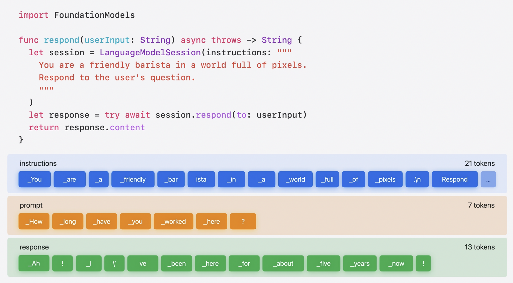

* `respond(to:)` 호출시 session 의 instruction, prompt(`userInput`) 을 가져옴
* Text 는 token 으로 변환, foundation model 이 알아서 추상화해서 처리

**Token 이 증가할수록 지연 시간이 길어짐. Response token 생성 전 model 은 Input token 을 모두 처리해야 하며 token 생성에는 계산이 필요하기 때문에 출력이 길수록 지연 시간이 길어짐.**

즉 **Token 의 수를 적게 유지하는 것이 속도 측면에서 좋음**

### Stateful

`LanguageModelSession` 은 stateful. 모든 `respond(to:)` 의 결과 값이 transcript 에 기록됨

Transcript : 특정 session 의 모든 prompt, response 포함

### Context limit 해결

**Session 에는 context limit 존재**

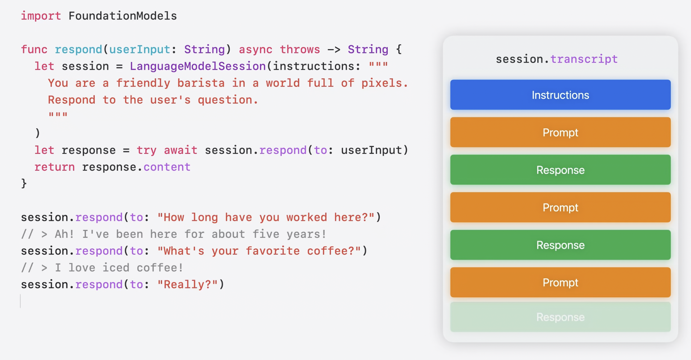

많은 prompt 생성 / 긴 prompt 입력 시 오류 발생

```swift
var session = LanguageModelSession()

do {
  let answer = try await session.respond(to: prompt)
  print(answer.content)
} catch LanguageModelSession.GenerationError.exceededContextWindowSize {
  // New session, with some history from the previous session.
  session = newSession(previousSession: session)
}

private func newSession(previousSession: LanguageModelSession) -> LanguageModelSession {
  let allEntries = previousSession.transcript.entries
  var condensedEntries = [Transcript.Entry]()

  if let firstEntry = allEntries.first {
    // 첫 번째 entry : Instruction
    condensedEntries.append(firstEntry)

    // 마지막 성공적인 response
    if allEntries.count > 1, let lastEntry = allEntries.last {
      condensedEntries.append(lastEntry)
    }
  }
  let condensedTranscript = Transcript(entries: condensedEntries)
  // Note: transcript includes instructions.
  return LanguageModelSession(transcript: condensedTranscript)
}
```

* `exceededContextWindowSize` error catch
* 이전 세션의 transcript 일부를 새로운 세션에 넣어 이전 대화의 문맥을 기억하도록 설정

이전 transcript 를 요약 (외부 라이브러리 / Foundation model 사용)해서 다음 세션에 넣어 부족한 점 보완

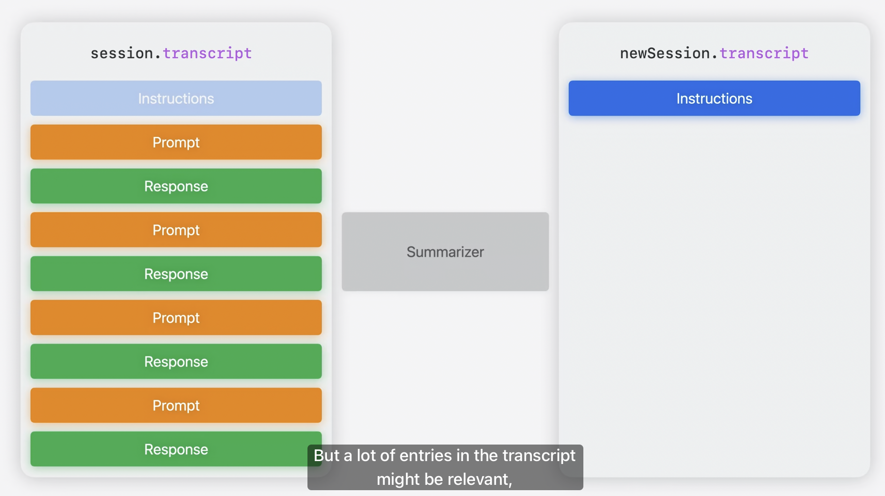

### Response Generation

같은 질문을 해도 다른 출력이 나오는 이유? : Sampling

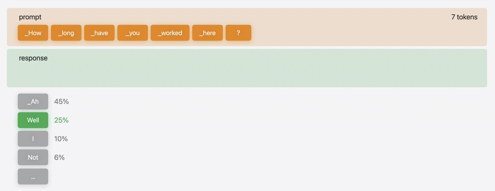

* 출력 생성시 모델은 token 들 생성, token 마다 선택될 확률 분포 생성
* Foundation model 은 기본적으로 무작위 sampling 채택
* 샘플링 효과를 없애고 싶으면 `GenerationOptions` API 사용

```swift
// Deterministic output
let response = try await session.respond(
  to: prompt,
  options: GenerationOptions(sampling: .greedy)
)
                
// Low-variance output
let response = try await session.respond(
  to: prompt,
  options: GenerationOptions(temperature: 0.5)
)
                
// High-variance output
let response = try await session.respond(
  to: prompt,
  options: GenerationOptions(temperature: 2.0)
)
```

* GenerationOptions
    * Session 상태가 동일할 경우 같은 prompt 에 대한 동일한 output 을 얻을 수 있음
    * OnDevice 특정 버전 모델에만 적용, OS 업데이트로 모델이 업데이트 되면 다른 output 생성될 수 있음

### Supported Language

특정 언어를 지원하는지 확인

```swift
var session = LanguageModelSession()

do {
  let answer = try await session.respond(to: userInput)
  print(answer.content)
} catch LanguageModelSession.GenerationError.unsupportedLanguageOrLocale {
  // Unsupported language in prompt.
}

let supportedLanguages = SystemLanguageModel.default.supportedLanguages
guard supportedLanguages.contains(Locale.current.language) else {
  // Show message
  return
}
```

## Generable

Model 이 Swift 타입을 통해 구조화된 데이터를 생성하도록 하는 방법

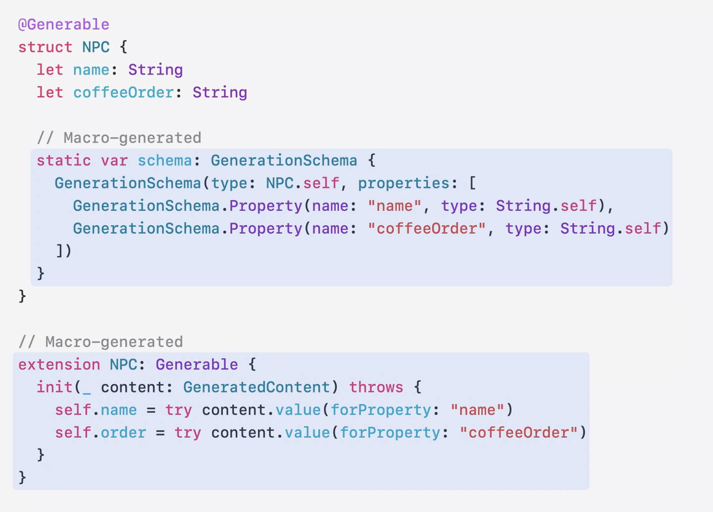

Compile time 에 Schema 생성, session 에 request 를 요청할 때 자동으로 호출되는 initializer 도 생성

### Constrained Decoding

Model 이 특정 schema 를 따르는 텍스트를 생성하도록 하는 기술

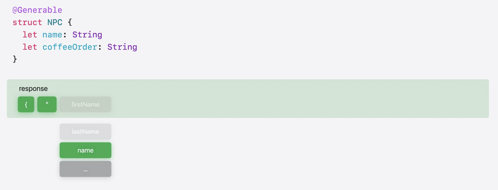

* LLM 은 token 을 생성 -> 나중에 text 로 변환됨
* Generable 을 통해 text 를 type-safe 한 방식으로 parsing
* Token 들이 생성되면 constrained decoding 은 문법적으로 schema 에 유효한 token 만 선택 될 수 있게 함 (firstName, lastName, name, ... token 에서 name 이 schema 에 정의되어 있으므로 해당 token 선택) 

### enum

enum 타입도 정의 가능

```swift
@Generable
struct NPC {
  let name: String
  let encounter: Encounter

  @Generable
  enum Encounter {
    case orderCoffee(String)
    case wantToTalkToManager(complaint: String)
  }
}
```

### Guide

Guide macro 를 property 에 적용해서 constrained decoding 을 통해 해당 제약에 적합한 값만 출력할 수 있음

```swift
@Generable
struct NPC {
  @Guide(description: "A full name")
  let name: String
  @Guide(.range(1...10))
  let level: Int
  @Guide(.count(3))
  let attributes: [Attribute]
  let encounter: Encounter

  @Generable
  enum Attribute {
    case sassy
    case tired
    case hungry
  }
  @Generable
  enum Encounter {
    case orderCoffee(String)
    case wantToTalkToManager(complaint: String)
  }
}
```

**Generable 타입의 property 는 코드 내에서 정의된 순서대로 생성**

e.g. name -> level -> attribute

* 특정 property 의 값이 다른 property 에 영향을 받는 경우 순서가 중요함
* 전체 출력이 생성될 때까지 기다리지 않고 property 별로 streaming 가능

* Int/Float/Double/Decimal
    * `.minimum(1)`
    * `.maximum(10)`
    * `.range(1...10)`
* Array
    * `minimumCount(1)`
    * `.maximumCount(10)`
    * `.count(3)`
    * `.element(.minimum(1))`
* String
    * `.constant("NPC")`
    * `.anyOf(["barista", "guest"])`
    * `.pattern(/(Mr|Mrs)\. \w+/)` // 정규표현식

정규표현식의 경우 `RegexBuilder`를 사용할 수도 있음

```swift
@Generable
struct NPC {
  @Guide(Regex {
    Capture {
      ChoiceOf {
        "Mr"
        "Mrs"
      }
    }
    ". "
    OneOrMore(.word)
  })
  let name: String
}

session.respond(to: "Generate a fun NPC", generating: NPC.self)
// > {name: "Mrs. Brewster"}
```

## Dynamic schemas

`DynamicGenerationSchema`를 사용해서 Runtime 에 schema 를 생성할 수 있음

Runtime 에서만 구조를 아는 경우 유용 e.g. 사용자가 런타임에서 사용할 entity 를 직접 정의하고 싶은 경우

```swift
struct LevelObjectCreator {
  var properties: [DynamicGenerationSchema.Property] = []

  mutating func addStringProperty(name: String) {
    let property = DynamicGenerationSchema.Property(
      name: name, // 이름
      schema: DynamicGenerationSchema(type: String.self) // 타입을 정의하는 자체 schema. 모든 Generable Type + 내장된 type 에 사용할 수 있음
    )
    properties.append(property)
  }

  // 배열 포함 가능
  mutating func addArrayProperty(name: String, customType: String) {
    let property = DynamicGenerationSchema.Property(
      name: name,
      schema: DynamicGenerationSchema(
        arrayOf: DynamicGenerationSchema(referenceTo: customType) // 다른 schema 참조
      )
    )
    properties.append(property)
  }

  var root: DynamicGenerationSchema {
    DynamicGenerationSchema(
      name: name,
      properties: properties
    )
  }
}

// 각 Schema 는 독립적
// riddle Schema
var riddleBuilder = LevelObjectCreator(name: "Riddle")
riddleBuilder.addStringProperty(name: "question")
riddleBuilder.addArrayProperty(name: "answers", customType: "Answer") // Answer 이름으로 schema 참조

// Answer Schema
var answerBuilder = LevelObjectCreator(name: "Answer")
answerBuilder.addStringProperty(name: "text")
answerBuilder.addBoolProperty(name: "isCorrect")

let riddleDynamicSchema = riddleBuilder.root
let answerDynamicSchema = answerBuilder.root

let schema = try GenerationSchema(
  root: riddleDynamicSchema,
  dependencies: [answerDynamicSchema]
)

let session = LanguageModelSession()
let response = try await session.respond(
  to: "Generate a fun riddle about coffee",
  schema: schema
)
let generatedContent = response.content // dynamic value 담고 있음 
// property 이름으로 value 를 query 할 수 있음
let question = try generatedContent.value(String.self, forProperty: "question")
let answers = try generatedContent.value([GeneratedContent].self, forProperty: "answers")
```

Dynamic 이어도 Foundation Models 를 Guided Generation 을 사용하기 때문에 output 이 schema 와 일치하는지를 확인하며 unexpected field 는 생성하지 않음

### 정리

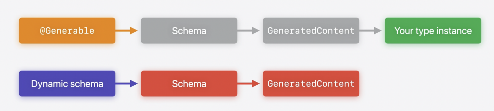

* `Generable` macro
  * Compile time 에 structured output 얻을 수 있음
  * Foundation Models 가 schema 를 처리함
  * `GeneratedContent` 를 자체 정의한 instance 로 변환
* Dynamic Schema
  * Runtime 에 schema 제어
  * `GeneratedContent` 에 직접 접근 가능

## Tool calling

개발자가 작성한 함수를 model 이 호출할 수 있게 해주는 것

`Tool` protocol 사용

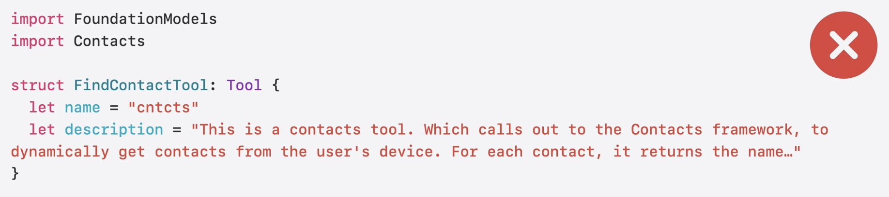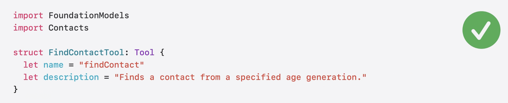

* 주의사항
  * `name` : 짧고 읽기 쉬운 영어 이름. 이름에 동사 사용
  * `description` : prompt 에 그대로 입력되는 문자열이기 때문에 짧고 간결 (문자열 길수록 token 수 증가해서 latency 증가)
  * 다양한 옵션을 시도해서 tool 이 잘 작동하는 것을 찾는 것도 중요

### Tool 정의

```swift
import FoundationModels
import Contacts

struct FindContactTool: Tool {
  let name = "findContact"
  let description = "Finds a contact from a specified age generation."
    
  @Generable
  struct Arguments {
    let generation: Generation
        
    @Generable
    enum Generation {
      case babyBoomers
      case genX
      case millennial
      case genZ            
    }
  }

  // Model 이 이 tool 을 사용하면 input arguments 를 생성
  // input arguments 는 Generable 을 통해 항상 유효한 값만 생성
  // Tool 이 call 될 때 호출
  func call(arguments: Arguments) async throws -> ToolOutput {
    let store = CNContactStore()
        
    let keysToFetch = [CNContactGivenNameKey, CNContactBirthdayKey] as [CNKeyDescriptor]
    let request = CNContactFetchRequest(keysToFetch: keysToFetch)

    var contacts: [CNContact] = []
    try store.enumerateContacts(with: request) { contact, stop in
      if let year = contact.birthday?.year {
        if arguments.generation.yearRange.contains(year) {
          contacts.append(contact)
        }
      }
    }
    guard let pickedContact = contacts.randomElement() else {
      return ToolOutput("Could not find a contact.")
    }
    return ToolOutput(pickedContact.givenName)
  }
}
```

### Tool 사용

```swift
import FoundationModels

let session = LanguageModelSession(
  tools: [FindContactTool()], // Initializer 에 전달
  instructions: "Generate fun NPCs"
)
```

* 직접 contact 를 가져오는 것보다 좋은 이유 : Model 이 필요한 경우에만 해당 tool 을 호출하기 때문

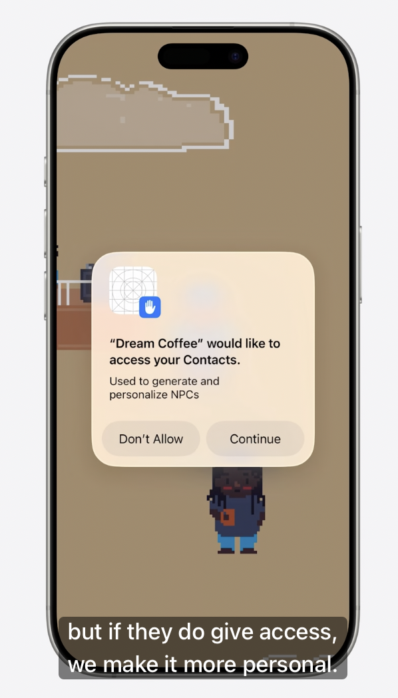

`FindContactTool` 에서는 권한을 요청하는데, 사용자가 허용하지 않더라도 Foundation Model 은 기존 방식대로 contents 생성 가능

### Tool State

Session instance 에서 tool 들의 instance 를 받기 때문에 tool 의 lifecycle 을 제어할 수 있음. Tool instance 는 session 이 유지되는 동안 유지됨

```swift
import FoundationModels
import Contacts

// Class 로 변경 (상태 추적 위함)
class FindContactTool: Tool {
  let name = "findContact"
  let description = "Finds a contact from a specified age generation."
   
  var pickedContacts = Set<String>() // 이미 선택된 연락처 추적
    
  ...

  func call(arguments: Arguments) async throws -> ToolOutput {
    contacts.removeAll(where: { pickedContacts.contains($0.givenName) })
    guard let pickedContact = contacts.randomElement() else {
      return ToolOutput("Could not find a contact.")
    }
    return ToolOutput(pickedContact.givenName)
  }
}
```

### 정리

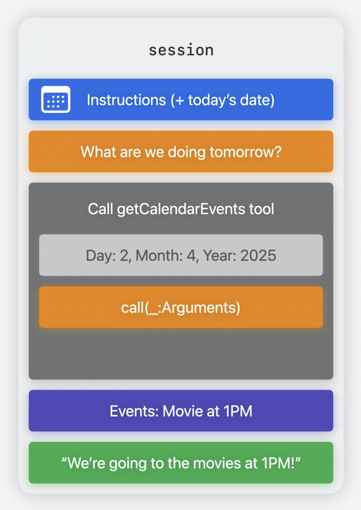

1. Session 시작 : Tool + instruction 전달 e.g. 오늘 날짜와 같은 정보 포함
2. 사용자가 Session 실행 : Model 이 text 분석
3. Model 이 tool 호출 결정
4. Model 이 input argument 생성 : instruction + prompt 정보를 사용해서 argument 를 어떻게 채워야 하는지 이해
5. Tool 의 call 메서드 호출
6. Output 생성, Tool 의 output 을 transcript 에 저장

*Tool 이 값을 반환할 때까지 기다린 후에 출력이 생성됨*

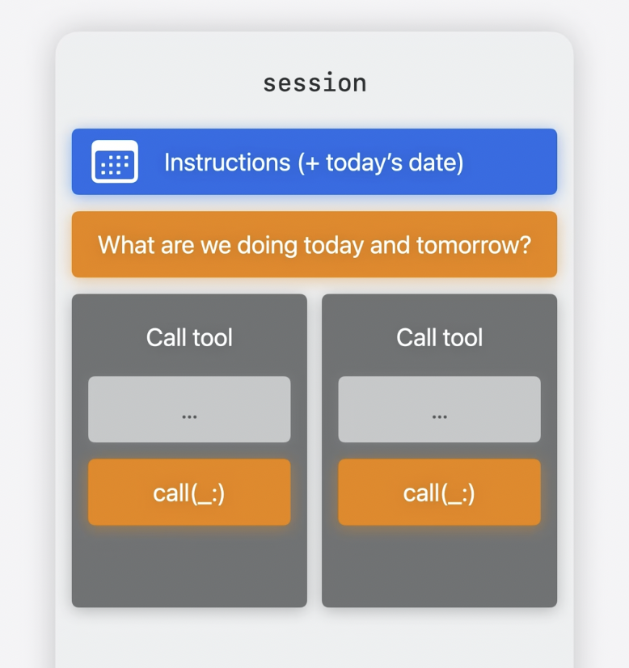

하나의 request 에서 tool 이 여러번 호출되는 경우 병렬로 실행됨 (데이터 접근에 유의)