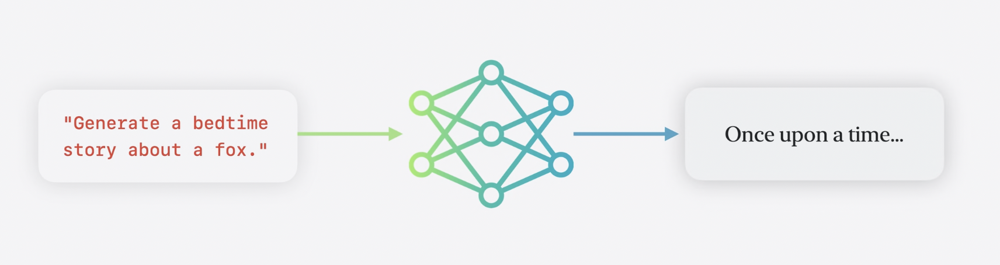

# 온디바이스 기반 모델에 대한 프롬프트 디자인 및 안정성 살펴보기

* prompt
    * Response 를 guide 하기 위해 AI model 에 입력하는 text input
    * 자연어로 작성
    * Apple Intelligence 에서 지원하는 모든 언어로 사용 가능

Prompt -> Foundation Model Framework (LLM) -> response

Writing Tools 에서 사용하는 것과 동일한 모델임

## Design for on-device LLM

다양한 작업을 수행할 수 있지만 소형 device 에 맞게 최적화되어 있기 때문에 서버 기반 LLM 보다 성능이 떨어질수밖에 없음

* 수행 가능 작업
    * Summarization
    * Classification
    * Multi-turn
    * Composition
    * Revision
    * Tagging

* 주의 사항
    * 복잡한 작업인 경우 여러 간단한 단계로 나눠 수행
    * 수학 연산은 계산기가 더 정확함
    * Code 에 최적화 되어 있지 않기 때문에 코드 생성도 피하기
    * World knowledge / events 에 대한 지식이 한정적

### Hallucination

Model 이 알지 못하는 지식에 대해 완전한 허위 response 를 생성하는 것

사실 확인을 모델에 의존하지 말아야 함. 확인해야 할 경우 검증된 정보를 prompt 에 포함시켜 모델에 제공하는 방식 검토

## Prompting best practices

* Response content 양 제어
    * e.g. 한 문단으로 만들어줘
    * short : "세 문장으로", "몇 마디로"
    * long : "자세히"
* Role & Style
    * 스타일, 어조에 대한 가이드를 prompt 에 포함
* Prompt 를 명확한 명령어로 구성
* Model 은 상세/특정 작업 하나를 request 받았을 때 성능이 좋음
* 원하는 output 이 있다면 5개 미만으로 model 에 예시를 prompt 에 제공
* 대문자 명령 : 강조
    * e.g. 'DO NOT'

### Instructions

Model 이 모든 뒤따라오는 prompt 에 대해 어떻게 행동해야 하는지 가이드를 주는 특별한 prompt

**Instruction 은 다른 prompt 보다 우선시 됨**

* Instruction : "너는 청소년을 위한 무서운 이야기를 만드는 조수야"
    * 후속 prompt 1 : "동화 만들어줘" -> 무서운 동화 생성
    * 후속 prompt 2 : "베이글에 대한 시를 써줘" -> 무서운 시 생성

## Design for safety

사용자도 prompt 를 작성할 수 있기 때문에 안전에 영향을 줌.

Foundation Model Framework 에는 안전한 사용자 경험을 위한 guardrail 이 존재

### Guardrail

Model input, output 에 모두 적용되어 유해한 input / output 을 차단하는 것

* Proactive Feature : guardrail 오류 무시하기. 사용자에게 알릴 필요 X
* User-initiaed Feature : UI 피드백 제공

### Building Trust Element

* 부적절한 content 피하기 (guardrail 도 여기에 기여)
* 사용자 input 처리 (instruction, prompt)
* 생성된 contents 가 사용자에게 미칠 영향 예상

1. Prompt 에 구체적인 지침 추가

안전 지침을 추가해서 response quality 향상

2. Instruction 은 개발자가 제공해야 함

Instructions 에는 반드시 개발자가 만든 신뢰할 수 있는 contents 만을 포함해야 함.

Prompt 에는 개발자가 작성한 prompt + 사용자 input 을 조합하는 방식으로도 구성 가능. 가장 좋은 방식은 내장된 prompt 목록을 제공해 사용자가 선택하게 하는 것

3. 사용자에게 미칠 영향 예상

베이글 추천을 받았는데 알러지 정보가 없다면? 사용자에게 위험이 될 수 있음. 얼럿을 보여주거나 사용자가 설정한 알러지 정보를 바탕으로 response 를 filtering 하게 할 수도 있음

### Layering-based approach - safety toolbox

모든 layer 에서만 놓쳤을 때 safety 문제가 발생하도록 하는 방식

* Layers
    * 기본 내장 Guardrail
    * Instruction 을 통한 safety (Prompt 에 우선시됨)
    * 사용자 prompt 를 제어
    * Own use case mitigation 적용

## Evaluate and test

* Data set 준비 : 모든 use case 를 cover 하는 prompt 수집 (safety issue 있는 prompt 포함)
* 테스트 자동화 : 기능의 처음부터 끝까지 실행하는 자동화 / CLI / 앱 생성
* 대규모 dataset 의 경우 다른 LLM 사용해서 response 에 점수 매기도록 하는 방법도 있음
* Unhappy path 테스트

➡️ Apple model update 과정에서 improvement / regressions 추적 가능

### Checklist

- [] Guardrail violation error 를 처리하고 있는지?
- [] Instruction 에서 safety 요소를 추가했는지?
- [] 사용자 input 을 제어하고 있는지? (유연성-안정성 밸런스)
- [] 사용자에게 미칠 영향 고려해서 use case-specific mitigations 적용하고 있는지? (알러지 예시)
- [] 테스트 