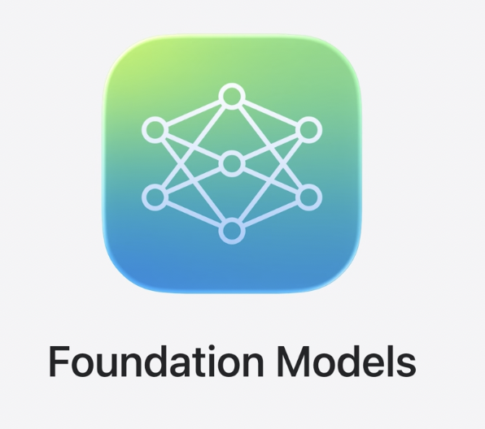
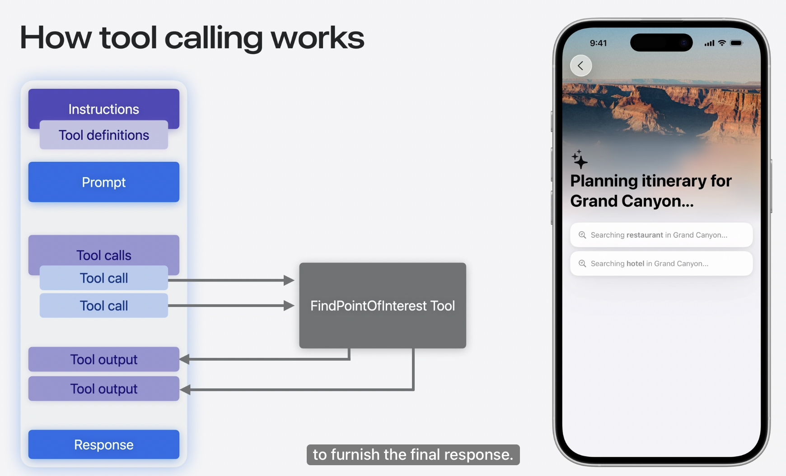

# Meet the Foundation Models framework

## Foundation Models



**On-device** LLM 에 Swift API 를 통해 접근 가능


* On-device
    * 데이터 안전
    * 네트워크 없이도 동작
    * OS 에 빌드되어 있어 앱 용량이 증가하지 않음

## The model

모델에 적절한 프롬프트를 입력하는 것이 중요함

### Xcode Playground

`#Playground` macro 를 사용해서 모델에 prompt 보낼 수 있음.

`#Playground` 에서는 앱에 정의된 타입에 접근할 수 있어 앱 모델에 대한 반복문도 작성할 수 있음

### Consideration


* On-device model
    * 30 억개 매개변수 대규모 LLM
    * but 그럼에도 불구하고 여전히 device-scale model (on-device 구동을 위해 성능 낮을 수 있음..)
        * 최적화 된 용도 : Summarization, Extraction, Classfication, Tagging, Composition, Revision
        * 최적화되지 않음 : 세계 지식 / 고급 추론 작업
    * 작업 단위를 작게 나눠 처리
    * 특정 사용 사례 (e.g. Content tagging) 은 특수 Adapter 가 제공되어 모델 성능 향상

## Guided generation

LLM 을 사용한 기능을 만들 수 있게 해주는 Foundation Model framework 의 핵심 기능

* 문제 1 : LLM 은 비구조적인 자연어를 출력함. 사람은 읽기 쉽지만 **view 에 바로 적용하기는 어려움**


* 문제 2 : 특정 형태 (e.g. JSON / CSV) 를 모델에 요청. 하지만 이래도 **구체적인 지침을 추가해야 함. 모델은 확률적 (응답이 고정되어 있지 않음) 이기 때문에 신뢰할 수 없는 구조.**


### `@Generable`, `@Guide`

모델이 응답값으로 우리가 정의한 타입의 instance 를 생성하도록 하는 매크로

```swift
// Creating a Generable struct

@Generable
struct SearchSuggestions {
    @Guide(description: "A list of suggested search terms", .count(4))
    var searchTerms: [String]
}

// Responding with a Generable type

let prompt = """
    Generate a list of suggested search terms for an app about visiting famous landmarks.
    """

let response = try await session.respond(
    to: prompt,
    generating: SearchSuggestions.self
)

print(response.content)
```

* `@Generable` : 모델이 생성할 인스턴스 타입을 정의
* `@Guide` : Property 에 대한 자연어 설명과 함께 해당 property 로 설정될 수 있는 값을 제어


* 장점
    * 구조적 정확성 보장 : 모델의 응답값 타입을 보장할 수 있음
    * 간단한 프롬프트 : 프롬프트에 출력 관련 정의 필요 없음
    * View 로 바로 mapping 할 수 있는 타입 설정 가능
    * 모델 정확도 향상
    * 추론 속도 향상


* 가능한 타입
    * Primitive : String, Int, Float, Double, Bool
    * Array
    * Recursive type

## Snapshot streaming

### 기존 Token 방식


Text 는 Token 이라는 짧은 문자 단위로 생성되며, output 을 스트리밍할 때 token 은 *Delta* 라는 형태로 전달됨

Foundation Model Framework 는 다른 방식을 사용

### 문제점


* Delta 가 들어올 때 이를 쌓는 것은 개발자의 역할. Delta 가 들어올수록 response 는 점점 길어짐
* 결과값에 struct 가 있는 경우 복잡
    * e.g. delta 가 생성될때마다 greeting 문자열을 보여주려면 이미 쌓여있는 response 에서 parsing 을 해야하는데 복잡한 구조의 경우 쉬비 않음

➡️ Delta streaming 은 structured output을 다루기에 적합하지 않음

### 해결


Delta 생성시 framework 에서 snapshot 으로 변환

Snapshot : 부분적으로 생성된 response. Property 는 모두 optional 이고 model 이 response 를 더 생성할수록 property 가 채워짐

### PartiallyGenerated

`@Gnerable` macro expand 해서 확인 가능. 외부 구조를 그대로 반영하되 모든 프로퍼티가 optional


⬇️ session 에서 `streamResponse` 메서드 호출시 사용됨

```swift
// Streaming partial generations

// async sequence 
let stream = session.streamResponse(
    to: "Craft a 3-day itinerary to Mt. Fuji.",
    generating: Itinerary.self
)

for try await partial in stream {
    // Sequence 의 각 element 는 PartiallyGenerated Type
    // 각 element 는 snapshot 을 포함함
    print(partial)
}

/*
...
PartiallyGenerated(name: Optional("Mt. Fuji Itinerary"), dates: Optional(["2023-11-01", ""]))
PartiallyGenerated(name: Optional("Mt. Fuji Itinerary"), dates: Optional(["2023-11-01", "2023"]))
PartiallyGenerated(name: Optional("Mt. Fuji Itinerary"), dates: Optional(["2023-11-01", "2023-11-"]))
*/
```

### Best Practices

SU 에서는 `@State private var itinerary: ~~.PartiallyGenerated?` 과 같이 `@State` property 를 만든 후 시간에 따라 동적으로 UI 가 변하는 모습 볼 수 있음

* SU 에서는 애니메이션을 사용해서 지연 시간을 자연스럽게 만들기 (업데이트되는 요소들을 순서대로 업데이트)
* 배열 생성시 View 의 identity 관리
* Property 는 Swift 구조체 내부에 정의된 순서대로 생성되기 때문에 애니메이션, model 의 출력에 영향 줄 수 있음 
    
    (e.g. 응답값에 `summary` property 를 추가했는데, 이 property 는 구조체에서 가장 마지막에 선언될수록 퀄리티가 좋아진다)

## Tool calling

모델이 앱 내에 정의한 코드를 실행할 수 있게 해줌.

추가 정보 / 액션을 위한 작업이 필요함을 인지하고 프로그래밍적으로 결정하기 어려운 상황에서 어떤 tool 을 언제 어떻게 사용할지 알아서 판단할 수 있음

세계 지식, 최근 사건, 개인 정보를 데이터로 제공 가능



* 왼쪽 사각형 : 지금까지 일어난 모든 내용에 대한 transcript

1. Session 이 tool 을 instruction 과 함께 모델에 제시
2. Prompt
3. Model 의 판단 : Tool 을 사용하는 것이 응답에 도움이 되겠다
4. Tool calls : Tool 을 위해 작성한 코드를 자동으로 호출 e.g. 식당, 호텔 API 호출
5. Model 이 응답값을 자동으로 transcript 에 삽입
6. Response : 모델이 transcript (기존 정보 + 새로운 정보) 를 반영해서 생성

### Tool 정의

```swift
// Defining a tool
import WeatherKit
import CoreLocation
import FoundationModels

struct GetWeatherTool: Tool {
    // Model 이 Tool 을 언제 호출해야 할지 이해를 도와줌
    let name = "getWeather"
    let description = "Retrieve the latest weather information for a city"

    @Generable
    struct Arguments {
        @Guide(description: "The city to fetch the weather for")
        var city: String
    }

    // Tool call 시 실행되는 부분
    func call(arguments: Arguments) async throws -> ToolOutput {
        let places = try await CLGeocoder().geocodeAddressString(arguments.city)
        let weather = try await WeatherService.shared.weather(for: places.first!.location!)
        let temperature = weather.currentWeather.temperature.value

        // structured data 원할 경우
        let content = GeneratedContent(properties: ["temperature": temperature])
        let output = ToolOutput(content)

        // Or if your tool’s output is natural language:
        // let output = ToolOutput("\(arguments.city)'s temperature is \(temperature) degrees.")

        return output
    }
}
```

arguments 가 `Generable` 인 이유 : Tool calling 이 model 이 잘못된 tool 이름이나 argument 를 생성하지 않게 guided generation 을 기반으로 하고 있기 때문

### Tool 연결

생성한 tool 을 모델에 연결


* Session 생성시 initializer 에 tool 설정
* Session이 유지되는 동안 model 이 tool 사용 가능
* Tool calling 은 알아서 이루어짐

### Dynamic Tools

위의 케이스는 static case. Tool은 동적으로도 사용될 수 있음. e.g. dynamic schema 를 사용해서 runtime에서 Tool 의 argument, action 을 정의할 수 있음

## Stateful sessions

Foundation Models framework 는 상태 저장 세션 개념을 기반으로 함

세션을 생성하면 기본적으로 on-device, 일반 목적 사용용 모델에 prompt 를 전달하게 됨

### Instructions

모델에게 모델의 역할, 응답을 어떻게 해야하는지 가이드를 줄 수 있음 e.g. 스타일, 구체성

Optional, 사용하지 않으면 기본 instruction 이 사용됨

||Instructions|Prompts|
|-|-|-|
||개발자가 제공|개발자 + 사용자가 제공|
|우선순위|High(충돌날 경우 따름)|Low|

Instructions 는 대부분 정적이며 신뢰할 수 없는 prompt 를 instruction 에서 배제시키는 것이 좋음

### Multi-turn interations

```swift
// Multi-turn interactions

let session = LanguageModelSession()

let firstHaiku = try await session.respond(to: "Write a haiku about fishing")
print(firstHaiku.content)
// Silent waters gleam,
// Casting lines in morning mist—
// Hope in every cast.

let secondHaiku = try await session.respond(to: "Do another one about golf")
print(secondHaiku.content)
// Silent morning dew,
// Caddies guide with gentle words—
// Paths of patience tread.

print(session.transcript)
// (Prompt) Write a haiku about fishing
// (Response) Silent waters gleam...
// (Prompt) Do another one about golf
// (Response) Silent morning dew...
```

* `respond` / `streamResponse` 메서드를 사용하면 model 과의 각 상호작용은 context 로 저장되어 model 이 단일 세션 내에서 이전 대화 내용을 참고, 이해할 수 있음
* `transcript` property : 이전 대화 내용을 확인할 수 있음


* model 이 응답을 생성하는 동안 `isResponding` 이 true 로 바뀜
* View 내부에서 이 값을 관찰해서 true 일 동안 다른 prompt 를 전달하지 않도록 막아야 함

### Other specific model

기본 모델 외에 adapter 에 의해 보조되는 특정 목적에 적합한 model 도 있음

```swift
// Using a built-in use case

let session = LanguageModelSession(
    model: SystemLanguageModel(useCase: .contentTagging)
)
```

### Model 사용가능 여부 확인

Model 은 apple intelligence 지원 기기와 특정 지역에서만 실행됨

```swift
// Availability checking

struct AvailabilityExample: View {
    private let model = SystemLanguageModel.default

    var body: some View {
        switch model.availability {
        case .available:
            Text("Model is available").foregroundStyle(.green)
        case .unavailable(let reason):
            Text("Model is unavailable").foregroundStyle(.red)
            Text("Reason: \(reason)")
        }
    }
}
```