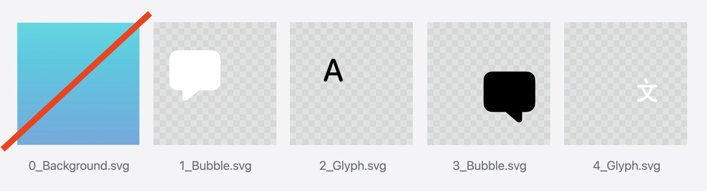

# Create icons with Icon Composer

* 기존
    * Retina 스크린 생기기 전 : 어디에 나타나든 artwork 가 잘 나타나게 하기 위해 픽셀 grid 에 맞추는 것이 중요했음
    * iOS, watchOS 의 등장 : 2x, 3x display 등장, 플랫폼 별로 이미지 하나만 제공하면 시스템이 자동으로 해주는 간소화된 작업

* Icon Composer 에서 모든 파일을 한 번에 작업할 수 있게 됨
* 하나의 artwork 로 iPhone, iPad, Mac, Watch 디자인 제작 가능
* 기본, dark, dark clear light, clear dark,.. 테스트 가능

## Design

* 확장성을 고려해서 SVG, Vector 그래픽을 사용하는 것이 좋음

[템플릿](https://developer.apple.com/design/resources/) 으로 시작 가능

Figma, Sketch, Photoshop, illustrator 에서 사용 가능

* iPhone, iPad, Mac : 1024px
* Watch : 1088px

Layer : Z 단계의 깊이를 나타냄

최하단 레이어는 배경에, 그 위에 다른 레이어가 쌓임

레이어를 유형별로 나누면 Icon Composer 에서 모드에 따라 색상 바꾸기가 용이함

Liquid Glass 로 레이어를 만들면 아래의 속성들은 Icon Composer 에서 동적으로 적용할 수 있음. 따라서 source art 는 기본 그래픽을 사용해서 flat, 불투명하게 만드는 것이 추후 유지보수에 용

## Export layers

* 간단한 배경, Gradient 는 Icon Composer에서 바로 적용되기 때문에 내보낼 필요 X
* 텍스트를 내보낼 때 SVG 형식은 글꼴 보존하지 않기 때문에 윤곽선으로 변환
* SVG로 표현되지 않는 요소는 PNG 로 내보내서 투명한 배경을 유지하면서도 손실 없게
* Export 할 때 둥근 사각형 / 원형 마스크를 포함하지 말기 (추후 자동으로 mask 가 적용되어 잘림)

## Icon Composer

## Deliver
